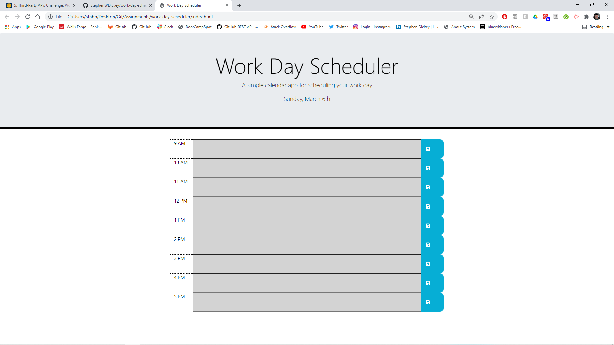

# work-day-scheduler

## Description
In this week's challenge we were tasked with created a weekday scheduler.

This schedule features a color-responsive script that will change the color of each time slot depending on the time of day.

This schedule uses jQuery, moment.js, and bootstrap for styling and script purposes.

This page should store tasks in localStorage, and those tasks should also be retrievable.

## Credits
StephenWDickey
GitHub page: https://github.com/StephenWDickey
Deployment URL:

Joseph Jepson - Coding Bootcamp tutor